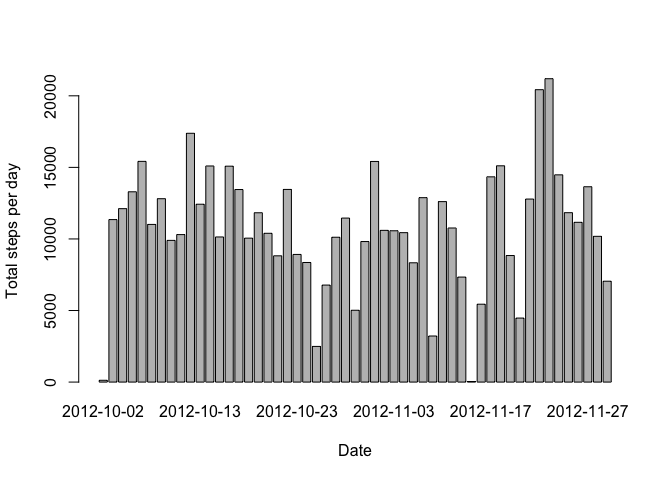
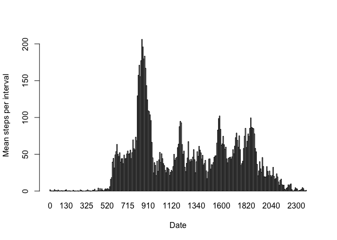
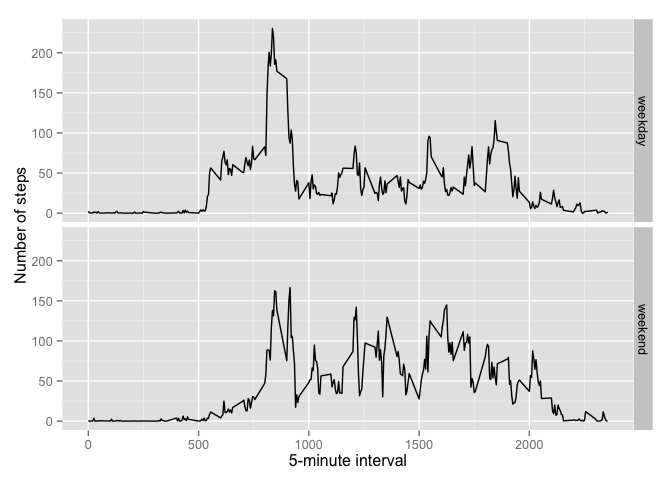

# Reproducible Research: Peer Assessment 1
### Unzip data file

```r
unzip("activity.zip")
```

## Loading and preprocessing the data
### Loading data frame from csv file

```r
data <- read.csv("activity.csv")
head(data)
```

```
##   steps       date interval
## 1    NA 2012-10-01        0
## 2    NA 2012-10-01        5
## 3    NA 2012-10-01       10
## 4    NA 2012-10-01       15
## 5    NA 2012-10-01       20
## 6    NA 2012-10-01       25
```

## What is mean total number of steps taken per day?
### Calculating total count of steps per day

```r
dataSumDaily <- aggregate(steps~date, data, sum)
head(dataSumDaily)
```

```
##         date steps
## 1 2012-10-02   126
## 2 2012-10-03 11352
## 3 2012-10-04 12116
## 4 2012-10-05 13294
## 5 2012-10-06 15420
## 6 2012-10-07 11015
```
### Plotting bar diagram of total count of steps per each day

```r
barplot(dataSumDaily$steps, names.arg=dataSumDaily$date, ylim=c(0,max(dataSumDaily$steps)), ylab="Total steps per day", xlab="Date")
```

 

### Calculating mean and median for total count of steps per day

```r
mean(dataSumDaily$steps)
```

```
## [1] 10766
```

```r
median(dataSumDaily$steps)
```

```
## [1] 10765
```

## What is the average daily activity pattern?
### Calculating mean number of steps per each interval

```r
dataMeanInterval <- aggregate(steps~interval, data, mean)
head(dataMeanInterval)
```

```
##   interval   steps
## 1        0 1.71698
## 2        5 0.33962
## 3       10 0.13208
## 4       15 0.15094
## 5       20 0.07547
## 6       25 2.09434
```
### Plotting bar diagram for mean count of steps per each interval during the day

```r
barplot(dataMeanInterval$steps, names.arg=dataMeanInterval$interval, ylim=c(0,max(dataMeanInterval$steps)), ylab="Mean steps per interval", xlab="Date")
```

 

### Interval which has max mean value of steps

```r
dataMeanInterval$interval[which.max(dataMeanInterval$steps)]
```

```
## [1] 835
```


## Imputing missing values
Will use mean value per interval to replace missing value with it.
### Count of missing values in data

```r
naSteps <- is.na(data$steps)
length(naSteps[naSteps==TRUE])
```

```
## [1] 2304
```
### Function to get a step value based on its step value and interval value

```r
### Replace each missing value with the mean value of its 5-minute interval
meanValue <- function(steps, interval) {
  value <- NA  
  if (!is.na(steps))
        value <- c(steps)
  else
        value <- (dataMeanInterval[dataMeanInterval$interval==interval, "steps"])
  value
  return (value)
}
```
### Replacing missing values with their mean values per their interval

```r
dataWithoutNa <- data
dataWithoutNa$steps <- mapply(meanValue, dataWithoutNa$steps, dataWithoutNa$interval)
```
### Plotting bar diagram for total steps per day without missing values, calculating mean and median

```r
barplot(dataWithoutNa$steps, names.arg=dataWithoutNa$date, ylim=c(0,max(dataWithoutNa$steps)), ylab="Total steps per day", xlab="Date")
```

 

```r
mean(dataWithoutNa$steps)
```

```
## [1] 37.38
```

```r
median(dataWithoutNa$steps)
```

```
## [1] 0
```

### Result - values are bigger because missing values were treated as 0, but now they have possitive value.
## Are there differences in activity patterns between weekdays and weekends?
### Function to decide weekday or weekend

```r
weekdayOrWeekend <- function(date) {
    day <- weekdays(date)
    if (day %in% c("Monday", "Tuesday", "Wednesday", "Thursday", "Friday"))
        return("weekday")
    else if (day %in% c("Saturday", "Sunday"))
        return("weekend")
    else
        stop("incorrect state")
}
```
### Converting date for date column from string to Date 

```r
dataWithoutNa$date <- as.Date(dataWithoutNa$date)
```
### Calculating dayType field to determine weekday or weekend

```r
#install.packages("ggplot2")
library(ggplot2)
dataWithoutNa$dayType <- sapply(dataWithoutNa$date, FUN=weekdayOrWeekend)
```
### Calculating average per interval 

```r
averageDataWithoutNa <- aggregate(steps ~ interval + dayType, data=dataWithoutNa, mean)
```
### Ploting two diagrams one for weekdays and other for weekends average value of steps per interval

```r
ggplot(averageDataWithoutNa, aes(interval, steps)) + geom_line() + facet_grid(dayType ~ .) + xlab("5-minute interval") + ylab("Number of steps")
```

 
